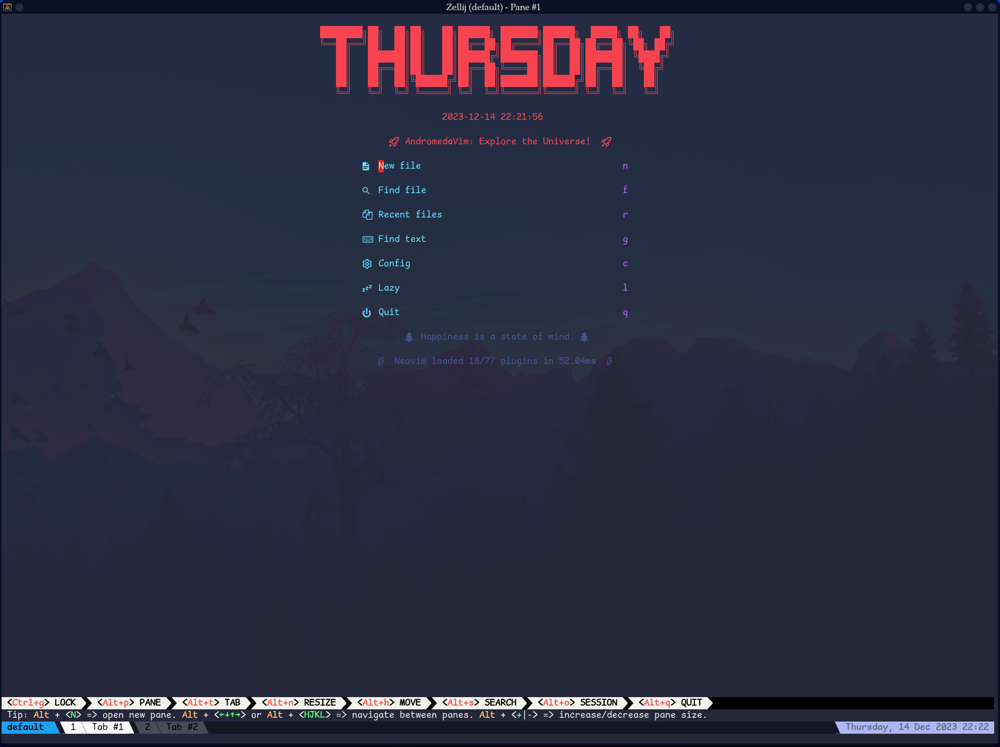
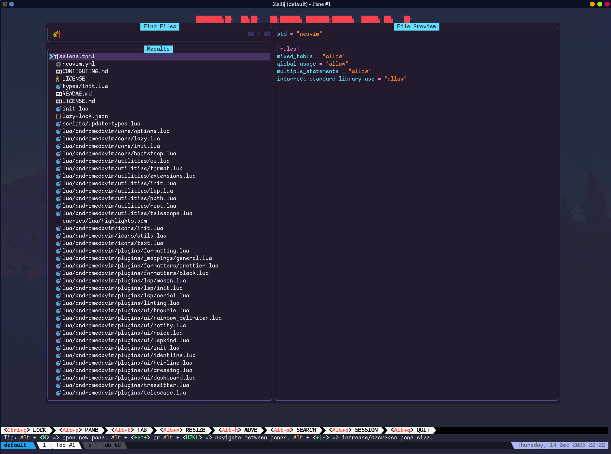
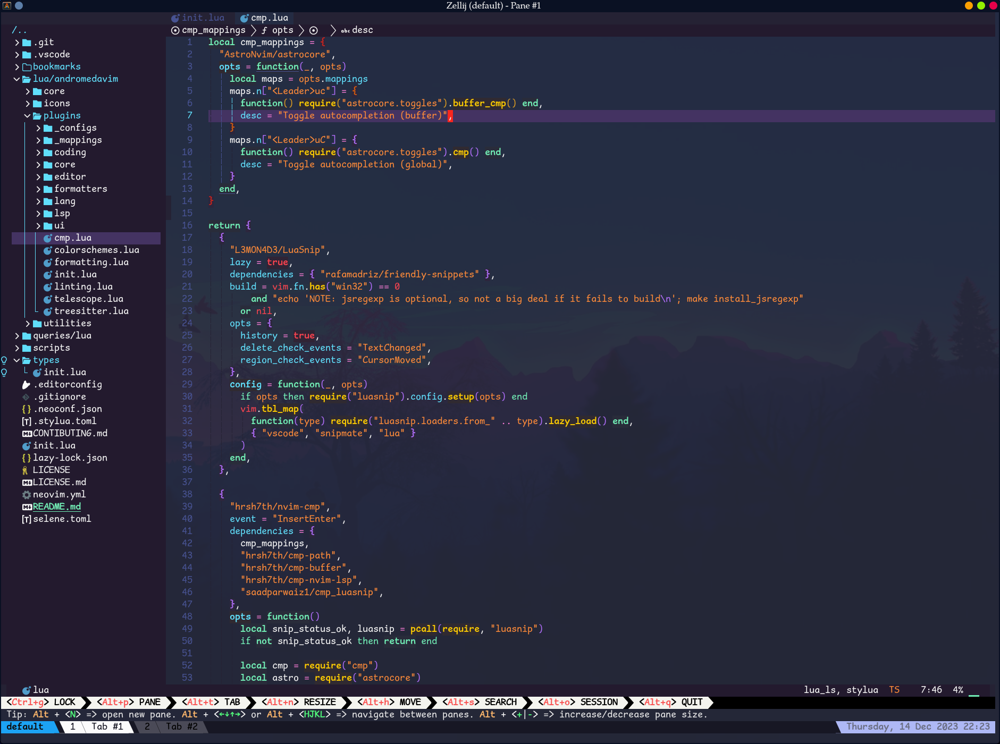

# AndromedaVim (using AstroNvim core libs)

This is my personal Neovim configuration. It uses the core libraries of [AstroNvim](https://astronvim.com/); [astroui](https://github.com/AstroNvim/astroui), [astrolsp](https://github.com/AstroNvim/astrolsp), and [astrocore](https://github.com/AstroNvim/astrocore)





## 🛠️ Installation

### Make a backup of your current nvim and shared folder

```shell
mv ~/.config/nvim ~/.config/nvim.bak
mv ~/.local/share/nvim ~/.local/share/nvim.bak
mv ~/.local/state/nvim ~/.local/state/nvim.bak
mv ~/.cache/nvim ~/.cache/nvim.bak
```

#### Clone the repository

```sh
git clone https://github.com/CosmicHalo/AndromedaVim ~/.config/nvim
```

#### Start Neovim

```sh
nvim --headless +q
```

## Contributing

We welcome contributions from the community to enhance Review App further. If you're interested in contributing, please read our [Contributing Guidelines](CONTRIBUTING.md) for detailed information on how to get started.

## License

This project is licensed under the [Apache License v2.0](https://github.com/lecoqjacob/AndromedaVim/blob/main/LICENSE).


